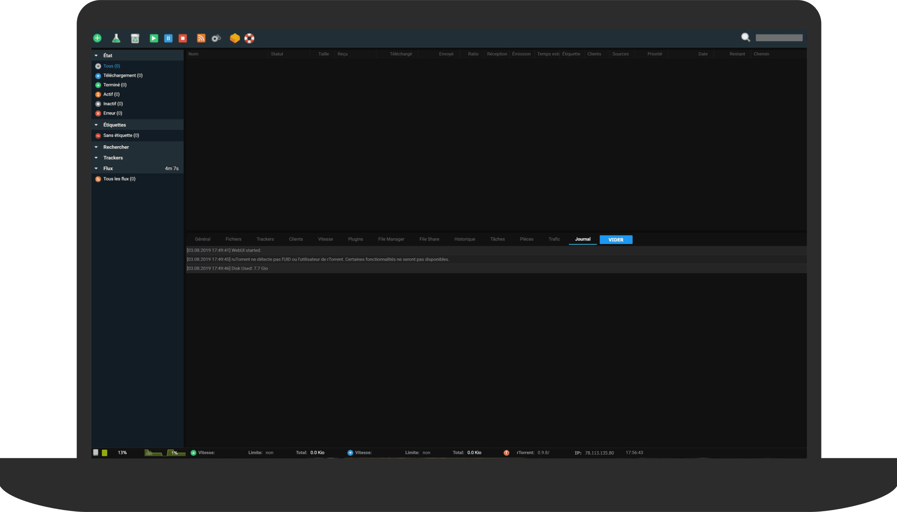

<p align="center">
    
    <p align="center">
        <a href="https://github.com/djerfy/docker-rutorrent"></a>
        <a href="https://hub.docker.com/r/djerfy/rutorrent"></a>
        <a href="https://github.com/djerfy/docker-rutorrent/tags"></a>
        <a href="https://travis-ci.org/djerfy/docker-rutorrent"></a>
        
        <br/>
        <a href="https://alpinelinux.org"></a>
        <a href="https://github.com/rakshasa/rtorrent"></a>
        <a href="https://github.com/Novik/ruTorrent"></a>
        <a href="https://www.filebot.net"></a>
    </p>
</p>

# Docker rTorrent + ruTorrent + Filebot

> Image of origin comes from [xataz](https://github.com/xataz): [docker-rtorrent-rutorrent](https://github.com/xataz/docker-rtorrent-rutorrent)

> Image `djerfy/rutorrent:latest` use **ruTorrent v3.10-beta** (works with **rTorrent v0.9.8**) but stable for use

## Features

* Based on Alpine Linux
* Tools compiled from sources
* Filebot is included by default
* No **root** process
* Save custom configuration rTorrent and ruTorrent
* Logs in output (Supervisor, Nginx, PHP-FPM, rTorrent)
* Various plugins activated (GeoIP, ratiocolor, showip, checksfs, ...)

## Tags

* latest ([Dockerfile](https://github.com/djerfy/docker-rutorrent/blob/latest/Dockerfile))

## Description

What is [ruTorrent](https://github.com/Novik/ruTorrent)?

* **ruTorrent** is a frontend for popular Bittorent client rtorrent.
* This project is released under the GPLv3 license, for more details, see at the LICENSE.md file in the source code.

What is [rTorrent](https://github.com/rakshasa/rtorrent)?

* **rTorrent** is the popular Bittorrent client.

## Configuration

### Environments

* `UID`: define uid to running services (default: `991`)
* `GID`: define gid to running services (default: `991`)
* `WEBROOT`: default URI access ruTorrent (default: `/`)
* `BASEURL`: default URL access ruTorrent (default: `localhost`)
* `BASEURL_SCHEME`: default scheme access ruTorrent (default: `http`)
* `BASEURL_USER`: define htpasswd username (default: `none`)
* `BASEURL_PASS`: define htpasswd password (default: `none`)
* `RTORRENT_PORT`: port used for rTorrent (default: `6881`)
* `RTORRENT_DHT`: if DHT is to be used (default: `off`)
* `FILEBOT_FOLDER`: define emplacement to create files (default: `Media`)
* `FILEBOT_METHOD`: method for rename media (default: `symlink`)
* `FILEBOT_MOVIES`: regex for rename movies (default: `"{n} ({y})"`)
* `FILEBOT_MUSICS`: regex for rename musics (default: `"{n}/{fn}"`)
* `FILEBOT_SERIES`: regex for rename tvshow (default: `"{n}/Season {s.pad(2)}/{s00e00} - {t}"`)
* `FILEBOT_ANIMES`: regex for rename animes (default: `"{n}/{e.pad(3)} - {t}"`)
* `FILEBOT_LICENSE_FILE`: define the license file (default: `none`)
* `FILEBOT_EXCLUDE_FILE`: define the exclude file, related with `$FILEBOT_FOLDER` (default: `/data/Media/amc.excludes`) 
* `FILEBOT_SCRIPT`: execute script after executing filebot command (default: `no`)
* `FILEBOT_SCRIPT_DIR`: define emplacement to have script `postexec` (default: `null`)
* `FILEBOT_LANG`: define language used for filebot (default: `en`)
* `FILEBOT_CONFLICT`: define actions for conflicts (default: `skip`)
* `DEBUG`: running with debug output (bool) (default: `false`)
* `SKIP_PERMS`: don't apply chown on medias (movies, tvshow, animes, ...) (default: `no`)
* `GEOIP_ACCOUNT_ID`: account required to download geoip databases (read GeoIP section) (default: `none`)
* `GEOIP_LICENSE_KEY`: license required (free) to download geoip databases (read GeoIP section) (default: `none`)

### Volumes

* `/data`: folder for download torrents
* `/config`: folder for rTorrent and ruTorrent configuration

### Ports

* `8080`: ruTorrent interface
* `6881`: rTorrent (override with `RTORRENT_PORT`)

### GeoIP

To receive a free license and to download the GeoLite2 databases (City/Country) [sign up for a GeoLite2 account here](https://www.maxmind.com/en/geolite2/signup). More details [on this page](https://dev.maxmind.com/geoip/geoip2/geolite2/).

In the left menu, select *Services* and *My License Key*. Here generate a new license key, in the output you have ACCOUNT ID and LICENSE KEY.

## Usage

### Basic

Access to ruTorrent interface: `http://xxx.xxx.xxx.xxx:8080/`

```bash
docker container run -d --name rutorrent -p 8080:8080 -p 6881:6881 djerfy/rutorrent:latest
```

### Advanced

With custom values:

```bash
docker container run -d \
    --name rutorrent \
    -p 8080:8080 \
    -p 9999:9999 \
    -e WEBROOT=/ \
    -e BASEURL=seedbox.example.com \
    -e BASEURL_SCHEME=https \
    -e RTORRENT_DHT=on \
    -e RTORRENT_PORT=9999 \
    -e FILEBOT_METHOD=move \
    -e GEOIP_ACCOUNT_ID=123456 \
    -e GEOIP_LICENSE_KEY=AZERTY123 \
    -e UID=1001 \
    -e GID=1001 \
    -e DEBUG=true \
    -v $(pwd)/data/data:/data \
    -v $(pwd)/data/config:/config \
    djerfy/rutorrent:latest
```

## Tests

Docker image is built and tested via [Travis CI](https://travis-ci.org/djerfy/docker-rutorrent/). Status of the last build [](https://travis-ci.org/djerfy/docker-rutorrent)

By default the last build (success) is pushed into Docker Hub with tag `nightly` (`djerfy/rutorrent:nightly`).

## Contributing

Any contributions, are very welcome!
